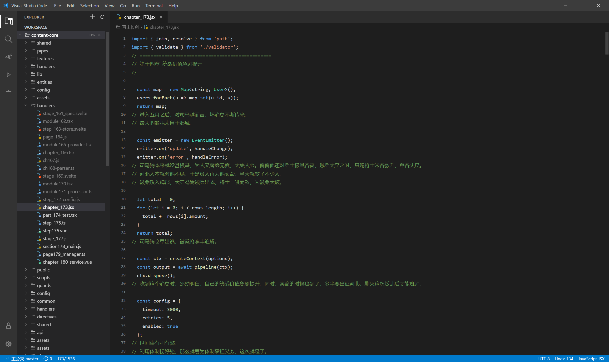

# SlackerVSCode

一个用 Electron 编写的、伪装成 VS Code 的小说阅读器。摸鱼专用。


## 功能特性

- **高度伪装成 VS Code**

  - 自定义标题栏 + 可点开的菜单栏（File / Edit / Selection / View / Go / Run / Terminal / Help）
  - 左侧 Activity Bar（Explorer / Search / Source Control / Run / Extensions）
  - 蓝色状态栏、标签页、面包屑、行号
  - 代码语法高亮配色（关键字蓝、字符串橙、注释绿、类型青）
  - 无边框窗口 + 自绘窗口控制按钮
  - 数据存储在程序目录的 `.userdata`，不在用户配置目录留痕
- **小说正文伪装成代码**

  - 章节标题以 `// === 标题 ===` 注释块形式展现
  - 正文每一段以 `//` 注释形式展现（绿色字体）
  - 段落之间插入随机代码段（带完整语法高亮）
  - 顶部有随机 import 语句
  - 同一章节每次打开生成的代码一致（基于哈希种子，确定性随机）
- **书架管理**

  - 加载本地 txt 小说，支持多选
  - 自动识别 UTF-8 / UTF-8 BOM / GBK 编码
  - 书架显示每本书及阅读进度百分比
  - 可移除、可刷新
- **章节目录伪装**

  - 章节显示为随机英文文件名（带数字序号）：`chapter01_handler.ts`
  - 根据扩展名显示不同文件图标（TS 蓝 / JS 黄 / Vue 绿 / Svelte 橙）
  - 每 20 章拆分为一个子目录，目录名为随机英文单词（`src` / `lib` / `core`...）
  - 悬浮显示真实章节名称
  - 子目录可折叠展开，自动展开当前阅读章节所在目录
- **章节跳转**

  - 点击章节列表跳转
  - `Ctrl+P` 快速搜索跳章（支持按真实标题或伪装文件名搜索）
  - `Alt+←` / `Alt+→` 上一章 / 下一章
- **阅读进度记忆**

  - 每本书每章独立记录滚动位置
  - 切换章节回到顶部，回到读过的章节恢复上次位置
  - 启动自动恢复上次阅读

## 快捷键

| 快捷键                  | 功能            |
| ----------------------- | --------------- |
| `Ctrl+O`              | 打开小说        |
| `Ctrl+P`              | 快速跳转章节    |
| `Alt+←`              | 上一章          |
| `Alt+→`              | 下一章          |
| `Ctrl+B`              | 切换侧边栏      |
| `Ctrl+=` / `Ctrl+-` | 放大 / 缩小字体 |
| `Ctrl+0`              | 重置字号        |
| `Esc`                 | 关闭弹窗        |

## 安装与运行

```bash
# 安装依赖（Electron 二进制通过 npmmirror 下载）
npm install

# 启动应用
npm start

# 开发模式（带 DevTools）
npm run dev
```

## 项目结构

```
SlackerVSCode/
├── main.js              # 主进程：窗口、IPC、文件读取、编码识别
├── preload.js           # 安全的 contextBridge IPC 桥
├── package.json
├── .npmrc               # npmmirror 镜像配置
└── src/
    ├── index.html       # 整体布局
    ├── styles.css       # VS Code Dark+ 配色复刻
    ├── icons.js         # codicon 风格 SVG 图标 + 文件类型图标
    ├── disguise.js      # 伪装模块：章节文件名、子目录名、代码段、语法高亮
    └── renderer.js      # 全部业务逻辑
```

## 技术栈

- **Electron** — 跨平台桌面应用框架
- **iconv-lite** — GBK / UTF-8 编码识别与转换
- 纯原生 HTML/CSS/JS，无前端框架依赖

## 伪装示例

打开一章小说后，编辑器看起来是这样的：



## 许可证

MIT
